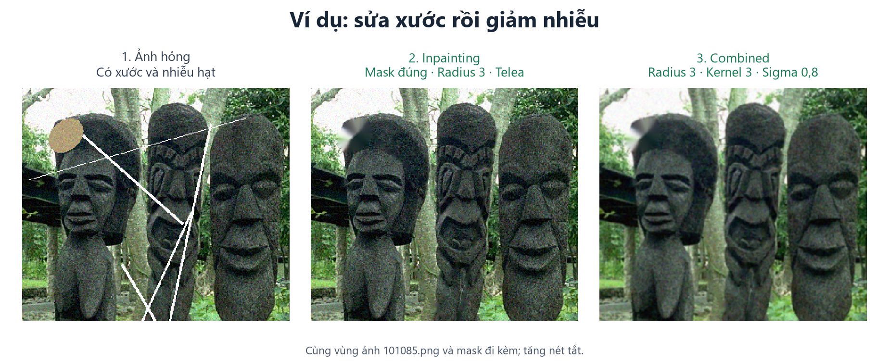
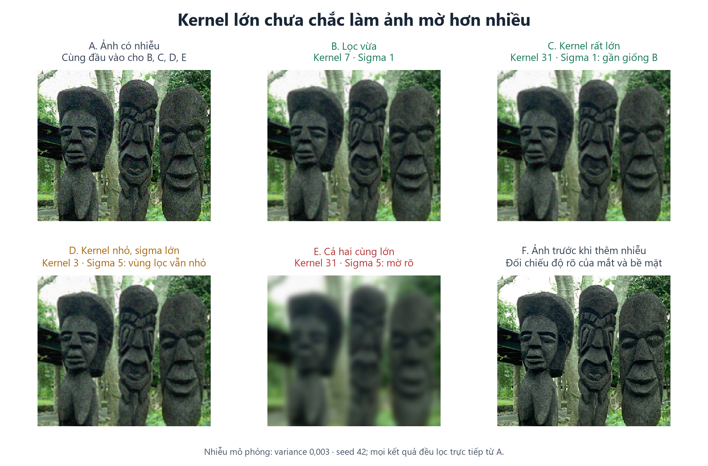
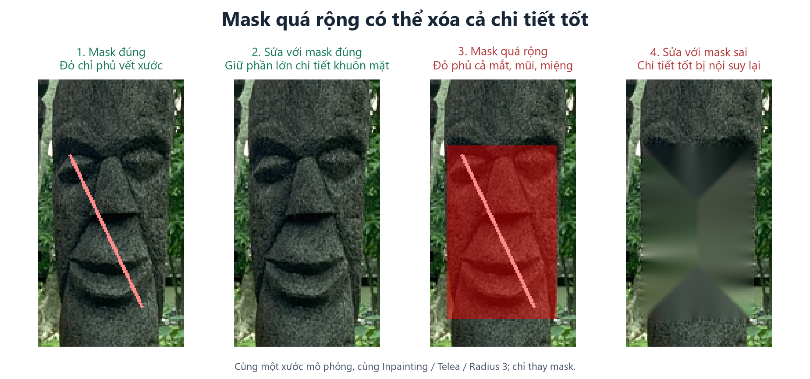

# Hướng dẫn dùng project khôi phục ảnh

Làm từ nhẹ đến mạnh: **mở ảnh → chọn cách sửa → chỉnh thông số → xem trước/sau → lưu PNG**.

## 1. Mở ứng dụng

Cần **Python 3.14+ và uv**. Nếu chưa có uv, cài bằng `winget install --id=astral-sh.uv -e`, rồi mở lại terminal.

Mở PowerShell tại thư mục project, nơi có `pyproject.toml`:

```powershell
uv python install 3.14
uv sync --locked
uv run project-1
```

## 2. Làm sạch một bức ảnh

1. Bấm **Mở ảnh hỏng…** hoặc **Ctrl+O**. Hỗ trợ PNG, JPG/JPEG, BMP; giữ một bản gốc riêng.
2. Chọn phương pháp trong **Thuật toán & tham số** theo bảng dưới.
3. Nếu dùng Inpainting/Combined, nạp mask qua **Tùy chọn ảnh → Mở mask từ file…**, hoặc dùng gợi ý mask ở mục 5.
4. Chỉnh thông số, mở tab **Khôi phục đơn**, bấm **Khôi phục ảnh**. Đổi thông số phải bấm chạy lại.
5. Xem trước/sau: cuộn chuột để zoom, giữ chuột trái để kéo; xem ở **1:1 — 100%** để kiểm tra tóc, chữ, mắt và cạnh vật thể.
6. Chọn **Lưu kết quả → Lưu ảnh khôi phục…**, lưu thành PNG với tên mới.

| Ảnh gặp vấn đề gì? | Chọn gì? | Cần mask? |
| --- | --- | --- |
| Có nhiễu hạt, không có xước | **Gaussian Filter**: làm mịn toàn ảnh | Không |
| Có xước/vùng hỏng nhỏ, ít nhiễu | **Inpainting**: sửa vùng được đánh dấu | Có |
| Vừa xước vừa nhiễu | **Combined**: sửa xước trước, làm mịn sau | Có |

Không có ảnh sạch vẫn sửa được. Chỉ nạp **ảnh tham chiếu đúng cặp** khi muốn xem PSNR/SSIM; không dùng ảnh hỏng làm tham chiếu.



*Ví dụ xử lý thật trên ảnh `101085.png`. Xước giảm sau Inpainting; Combined giảm thêm nhiễu. Vùng hỏng lớn vẫn có thể để lộ mảng vá, như ở góc trên bên trái.*

## 3. Kernel và Sigma: hiểu đơn giản

- **Kernel** là kích thước vùng pixel được xét. Kernel 3 nghĩa là vùng **3 × 3 pixel**. Dùng số lẻ: 3, 5, 7…
- **Sigma** quyết định mức ảnh hưởng của các pixel xa tâm: sigma nhỏ tập trung gần tâm; sigma lớn cho các pixel xa hơn nhiều ảnh hưởng hơn.

**Không chọn theo phép so sánh “Kernel phải lớn/nhỏ hơn Sigma”.** Hai số diễn tả hai đặc tính khác nhau. Kernel giới hạn vùng xét; sigma quyết định trọng số bên trong vùng đó. Đây là cách Gaussian hoạt động trong [OpenCV](https://docs.opencv.org/4.x/d4/d13/tutorial_py_filtering.html).

| Cách đặt | Điều gì xảy ra? | Nên làm gì? |
| --- | --- | --- |
| **Kernel rất lớn, sigma nhỏ**, ví dụ 31 / 1 | Pixel xa tâm có trọng số gần 0. So với 7 / 1, ảnh có thể gần như không đổi; chủ yếu tăng phần tính toán | Giữ kernel vừa đủ; tăng kernel không bảo đảm sạch hơn |
| **Kernel nhỏ, sigma rất lớn**, ví dụ 3 / 5 | Vùng xét vẫn chỉ 3 × 3; trọng số gần đều nhau, giống lấy trung bình trong vùng nhỏ | Nếu cần lọc rộng hơn, phải xem xét cả kernel; không chỉ tăng sigma mãi |
| **Cả hai cùng lớn**, ví dụ 31 / 5 | Làm mịn mạnh, dễ mất mắt, chữ, tóc và texture | Giảm sigma và kernel khi chi tiết bắt đầu nhòe |



*So B với C: chỉ tăng kernel, giữ sigma 1; trong ví dụ này hai kết quả trùng pixel. So với E: tăng cả hai làm mất chi tiết rõ rệt. Nhiễu trong hình này được thêm có kiểm soát để dễ so sánh.*

## 4. Cấu hình nên thử trước

Đây là **cấu hình thử ban đầu**, không phải bộ thông số tối ưu cho mọi ảnh:

| Trường hợp | Cấu hình bắt đầu |
| --- | --- |
| Nhiễu nhẹ | Gaussian: **kernel 3, sigma 0,8** |
| Xước mảnh | Inpainting: **Telea, radius 3**, mask đúng |
| Xước + nhiễu | Combined: **Telea, radius 3, kernel 3, sigma 0,8** |

Nếu còn nhiễu, thử sigma **1,0**, rồi **1,2**; có thể thử kernel **5**. Mỗi lần chỉ đổi một thông số và xem lại chi tiết. Với Inpainting, nếu mối nối chưa đẹp, thử radius **2** hoặc **5**, hoặc đổi sang Navier–Stokes.

Để **Tăng nét sau phục hồi** tắt lúc đầu. Khi ảnh đã sạch nhưng hơi mềm, thử mức **0,2–0,3**, sigma tăng nét **1,0**. Nếu có viền sáng/tối hoặc nhiễu nổi lên, giảm mức tăng nét hoặc tắt.

## 5. Mask: chọn đúng vùng cần sửa

Mask là một ảnh đánh dấu vị trí hỏng:

- **Trắng 255**: vùng cần sửa. **Đen 0**: vùng giữ nguyên ở bước Inpainting.
- Mask phải **cùng kích thước và đúng vị trí** với ảnh hỏng; nên lưu PNG đen/trắng.
- Chỉ đánh dấu vết hỏng, không tô rộng vào mắt, chữ hay chi tiết còn tốt. Không dùng mask 0/1 thay cho 0/255.

Để thử tạo mask trong app: **Tùy chọn ảnh → Gợi ý mask xước sáng… → Tạo gợi ý → xem lớp phủ đỏ → Áp dụng mask**. Tính năng này chỉ tìm xước sáng, mảnh; có thể chọn nhầm chi tiết sáng. Không áp dụng nếu vùng đỏ sai.



*Cùng một vết xước mô phỏng, cùng radius 3: chỉ thay mask đã làm kết quả khác hẳn. Màu đỏ là vùng được chọn để sửa.*

Mask đen chỉ bảo vệ pixel ở bước Inpainting. Combined còn lọc Gaussian trên toàn ảnh; tăng nét cũng có thể thay đổi vùng ngoài mask. Kéo chuột trên ảnh là di chuyển vùng xem, không phải vẽ mask.

## 6. Một số lỗi cần nhớ

| Lỗi / biểu hiện | Cách xử lý |
| --- | --- |
| Ảnh bệt, mất chi tiết | Giảm sigma; thử kernel nhỏ hơn. Không dùng tăng nét mạnh để bù lọc quá mức |
| Xước vẫn còn | Kiểm tra mask có phủ đúng vết xước không; Gaussian đơn thuần không thay thế Inpainting |
| Vùng vá lem hoặc xóa chi tiết tốt | Kiểm tra mask trước, rồi thử thay radius; vùng mất lớn khó phục hồi tự nhiên |
| Chỉnh số mà ảnh không thay đổi | Nhấn Enter/chuyển focus để xác nhận, rồi bấm **Khôi phục ảnh** lần nữa |
| Lọc nhiều lượt khiến ảnh càng mềm | Thử mỗi cấu hình từ **cùng ảnh hỏng ban đầu**, tránh nạp kết quả cũ rồi lọc tiếp |
| Batch bỏ qua ảnh vì thiếu mask | Ghép đúng **tên và phần mở rộng**, ví dụ ảnh `a.png` đi với mask `a.png` |

Muốn so các phương pháp, mở tab **So sánh phương pháp**, bấm **So sánh 3 phương pháp**. Không có mask thì Inpainting/Combined bị bỏ qua. Điểm PSNR/SSIM cao hơn trên cùng tham chiếu là thông tin hữu ích, nhưng vẫn cần nhìn ảnh: **ít nhiễu, còn chi tiết, không có viền hoặc mảng vá mới**.

Với **Xử lý hàng loạt**, chọn thư mục ảnh hỏng, mask nếu cần, tham chiếu tùy chọn và thư mục lưu khác đầu vào. Thử vài ảnh trước khi chạy cả bộ; Batch không tự tạo mask.
